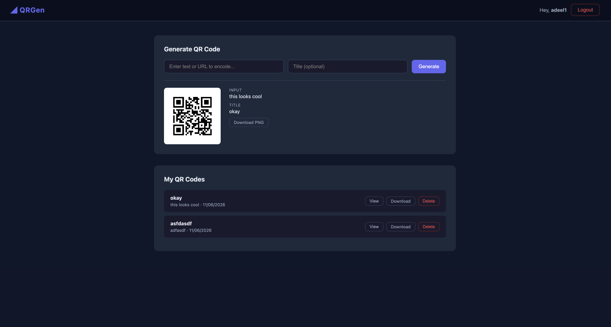

# QRGen — QR Code Generation Service



A self-contained microservice for generating QR codes. Users register, log in, and generate QR codes from any text or URL. Generated codes are stored per user with a full history, each downloadable as a PNG.

## Features

- User registration and login with JWT authentication
- Generate QR codes from any text or URL
- View and manage your QR code history
- Download QR codes as PNG files
- Dark theme web UI
- REST API ready for a React frontend

## Tech Stack

| Layer | Technology |
|---|---|
| Backend | Go 1.26, Gin |
| Auth | JWT (HS256, 24h expiry), bcrypt |
| Database | PostgreSQL + GORM |
| Frontend | Go HTML templates, vanilla JS |
| Tests | Go testing, SQLite in-memory |
| CI | GitHub Actions |

## Prerequisites

- [Go 1.26+](https://golang.org/dl/)
- PostgreSQL 14+ running and accessible
- `golangci-lint` (optional, for linting)

## Setup

**1. Clone the repository**

```bash
git clone https://github.com/adeelkhan/qr-service.git
cd qr-service
```

**2. Install dependencies**

```bash
go mod download
```

**3. Configure environment**

Copy the example below into a `.env` file in the project root and fill in your values:

```env
DB_HOST=localhost
DB_PORT=5432
DB_USER=your_db_user
DB_PASSWORD=your_db_password
DB_NAME=qrgen
JWT_SECRET=change-me-in-production
SERVER_PORT=9191
```

**4. Create the database**

```bash
psql -U your_db_user -c "CREATE DATABASE qrgen;"
```

Database tables are created automatically by GORM AutoMigrate when the server starts.

## Running

```bash
make run
```

The server starts at `http://localhost:9191` (or whatever `SERVER_PORT` is set to).

Alternatively, build a binary first:

```bash
make build
./bin/server
```

## Web UI

| URL | Description |
|---|---|
| `http://localhost:9191/register` | Create a new account |
| `http://localhost:9191/login` | Sign in |
| `http://localhost:9191/dashboard` | Generate and manage QR codes |

## API Reference

All API routes are under `/api/v1`. Authenticated routes require an `Authorization: Bearer <token>` header.

### Auth

| Method | Endpoint | Auth | Description |
|---|---|---|---|
| `POST` | `/api/v1/auth/register` | No | Register a new user |
| `POST` | `/api/v1/auth/login` | No | Log in, returns JWT |
| `POST` | `/api/v1/auth/logout` | No | Stateless logout |

**Register**
```bash
curl -X POST http://localhost:9191/api/v1/auth/register \
  -H 'Content-Type: application/json' \
  -d '{"username":"alice","email":"alice@example.com","password":"secret123"}'
```

**Login**
```bash
curl -X POST http://localhost:9191/api/v1/auth/login \
  -H 'Content-Type: application/json' \
  -d '{"username":"alice","password":"secret123"}'
# Response: { "token": "...", "expires_at": "..." }
```

### QR Codes

| Method | Endpoint | Auth | Description |
|---|---|---|---|
| `POST` | `/api/v1/qr/generate` | Yes | Generate a QR code |
| `GET` | `/api/v1/qr` | Yes | List all your QR codes |
| `GET` | `/api/v1/qr/:id` | Yes | Get a single QR code with image |
| `DELETE` | `/api/v1/qr/:id` | Yes | Delete a QR code |
| `GET` | `/api/v1/qr/:id/download` | Yes | Download QR code as PNG |

**Generate a QR code**
```bash
curl -X POST http://localhost:9191/api/v1/qr/generate \
  -H 'Authorization: Bearer <token>' \
  -H 'Content-Type: application/json' \
  -d '{"input_text":"https://github.com","title":"GitHub"}'
# Response: { "id": "...", "image_base64": "...", "download_url": "..." }
```

## Testing

Tests use an in-memory SQLite database, so no running PostgreSQL is needed.

```bash
make test
```

Generate an HTML coverage report:

```bash
make coverage
```

## Linting

```bash
make lint
```

Requires `golangci-lint` to be installed. See [installation guide](https://golangci-lint.run/usage/install/).

## Project Structure

```
qr-service/
├── cmd/server/         # Main entrypoint
├── internal/
│   ├── auth/           # Registration, login, JWT issuance
│   ├── config/         # Environment config loader
│   ├── database/       # GORM connection (Postgres + SQLite for tests)
│   ├── middleware/      # JWT auth middleware
│   ├── models/         # User and QRCode GORM models
│   └── qr/             # QR generation, storage, retrieval
├── web/
│   ├── static/         # CSS
│   └── templates/      # Go HTML templates
├── .github/workflows/  # GitHub Actions CI
├── .env                # Local environment (not committed)
├── Makefile
└── go.mod
```

## CI

GitHub Actions runs on every push and pull request to `main`:

1. Spins up a PostgreSQL 16 service container
2. Runs `golangci-lint`
3. Runs the full test suite (`make test`)
